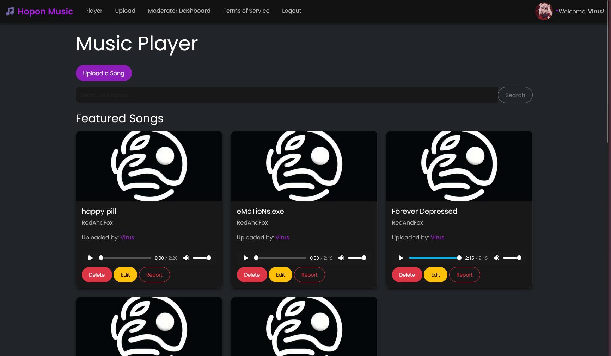

# HopOnMusic
A Music streaming platform

<p align="center">
  
</p>

## Customizing the Theme

To customize the app's appearance, edit the `static/custom.css` file. You can override the following CSS variables:

- `--primary-color`: The primary color used for buttons and links.
- `--background-color`: The background color of the app.
- `--text-color`: The text color.
- `--card-background`: The background color of cards (e.g., song items).
- `--card-border`: The border color of cards.
- `--font-family`: The font family used throughout the app.

You can also use `templates/` to customize the elements in the UI, aka adding or removing stuff

Example:
```css
:root {
    --primary-color: #ff5722; /* Orange */
    --background-color: #121212; /* Darker background */
    --text-color: #e0e0e0; /* Light gray text */
    --card-background: #333333; /* Darker card background */
    --card-border: #555; /* Darker card border */
    --font-family: 'Roboto', sans-serif; /* Custom font */
}
```

## Adding moderators

make a `.env` file and add `MODERATOR_IDS=1,2,3` replace the 1,2,3 with your ids which are visible on your profile. 

## our to-do list

you can find our to-do list [here](https://github.com/users/Virus01Official/projects/19)

## documentations

[self-hosted](https://github.com/Virus01Official/HoM-self-hosting) allows you to host Hopon Music yourself
